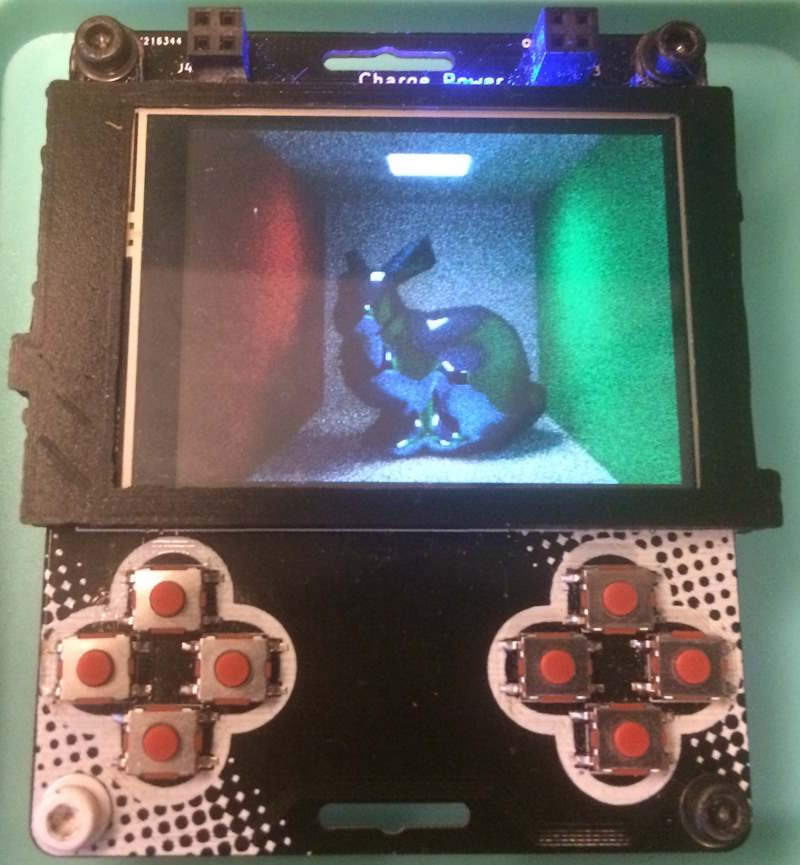
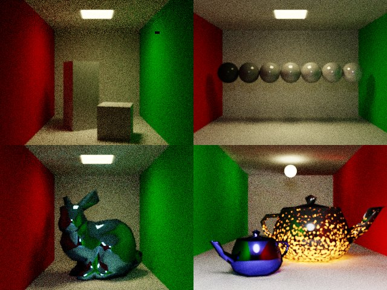

# Badge Display

## Introduction
This was a bit of an art project that I did for SIGGRAPH 2018. Path tracing seemed to be a big theme that year and I wanted a badge that spent the day path tracing. The plan was that it would start off fuzzy in the morning and by the end of the day render a clear image.

## Images

The final badge

The images that were rendered during the first four days of the conference. Each image took around 10 hours on 72MHz ARM processor.

